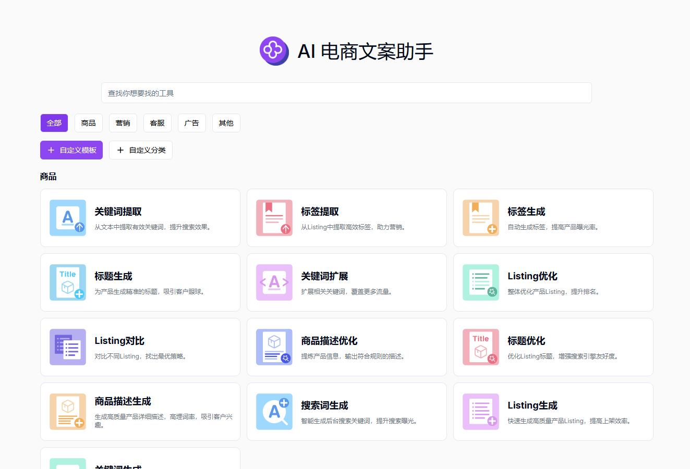
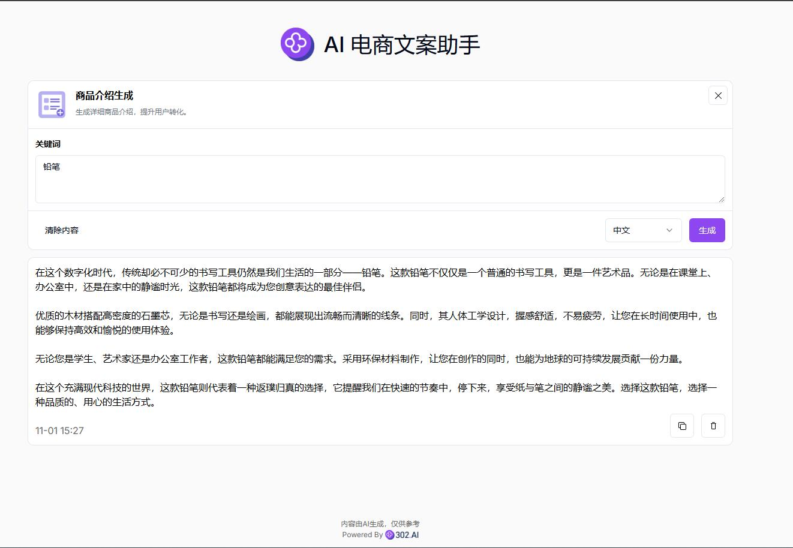

 # 💻🤖 Welcome to 302.AI's AI E-commerce Copywriting Assistant! 🚀✨

[中文](README_zh.md) | [English](README.md) | [日本語](README_ja.md)

This is the open-source version of [302.AI](https://302.ai)'s [AI E-commerce Copywriting Assistant](https://302.ai/tools/ecom/).
You can directly log in to 302.AI to use the online version with zero code and zero configuration.
Or modify this project according to your needs, input 302.AI's API KEY, and deploy it yourself.

## ✨ About 302.AI ✨
[302.AI](https://302.ai) is a pay-as-you-go AI application platform that solves the last mile problem of AI implementation for users.
1. 🧠 Aggregates the latest and most comprehensive AI capabilities and brands, including but not limited to language models, image models, voice models, and video models.
2. 🚀 Conducts deep application development on basic models - we develop real AI products, not just simple chatbots
3. 💰 Zero monthly fees, all features are pay-per-use, fully open, achieving truly low barriers with high potential.
4. 🛠 Powerful management backend for teams and SMEs - one person manages, multiple people use.
5. 🔗 All AI capabilities provide API access, all tools are open source and customizable (in progress).
6. 💡 Strong development team, launching 2-3 new applications weekly, products updated daily. Developers interested in joining are welcome to contact us

## Project Features
1. 🛠️ Multi-scenario Copywriting: Currently launched with five e-commerce scenario types, supporting over thirty e-commerce copywriting methods, and providing custom copywriting features to meet different needs.
2. 🌍 Multi-language Generation: Supports copywriting generation in multiple languages, including but not limited to Chinese, English, Japanese, etc., helping users easily handle content creation needs for global markets.
3. 🌐 Complete Internationalization: Supports Chinese, English, and Japanese interface switching, adapting to global users' habits.

With the AI E-commerce Copywriting Assistant, you can quickly generate high-quality creative content, optimize existing copy, and customize content based on different scenarios and target audiences. 🎉💻 Let's explore the new world of AI-driven code together! 🌟🚀

## Tech Stack
- Next.js 14
- Tailwind CSS
- Shadcn UI

## Development & Deployment
1. Clone project `git clone https://github.com/302ai/302_e_commerce_copywriting_assistant`
2. Install dependencies `npm install`
3. Configure 302's API KEY (refer to .env.example)
4. Run project `npm dev`
5. Build and deploy `docker build -t coder-generator . && docker run -p 3000:3000 coder-generator`

## Interface Preview

