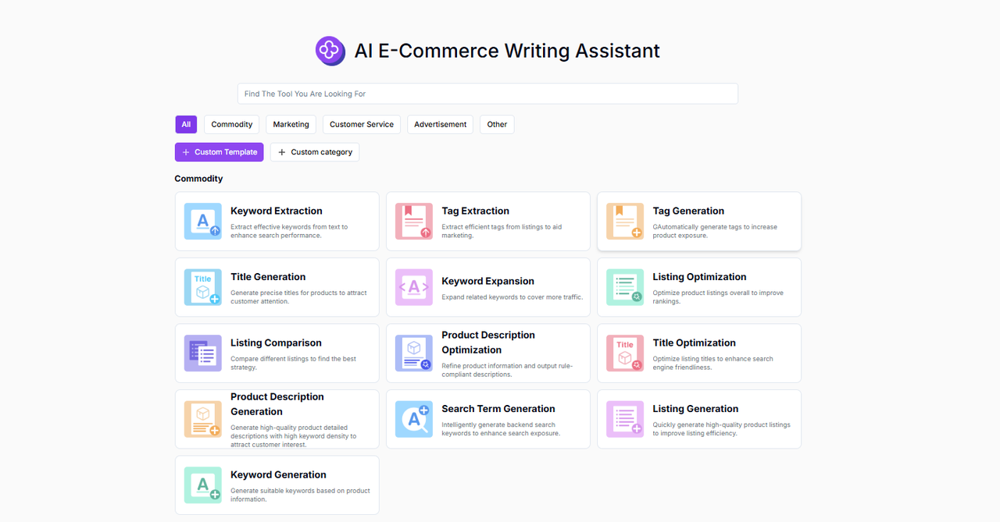
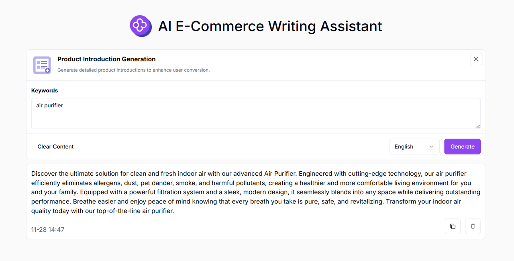

 # 
✏️ AI E-commerce Copywriting Assistant 🚀✨

The AI e-commerce copywriting assistant can quickly generate high-quality creative content, optimize existing copywriting, and customize personalized content according to different scenarios and target audiences.

<a href="README zh.md">中文</a> | <a href="README.md">English</a> | <a href="README_ja.md">日本語</a>

This is the open-source version of [302.AI](https://302.ai)'s [AI E-commerce Copywriting Assistant](https://302.ai/tools/ecom/).
You can directly log in to 302.AI to use the online version with zero code and zero configuration.
Or modify this project according to your needs, input 302.AI's API KEY, and deploy it yourself.

## Interface Preview
Multiple e-commerce scene types and copywriting writing methods have been launched and are available for selection. It also provides a custom copywriting production function to help you quickly generate high-quality copywriting.
     

Taking the generation of product introductions as an example, detailed product introductions can be generated just by inputting keywords, which helps to improve user conversion.

## Project Features
### 🛠️ Support for Multiple Scenarios and Platforms
Currently, five e-commerce scenario types have been launched, and it supports major e-commerce platforms such as Amazon, Walmart, Lazada, Etsy, Mercado Libre, Shopee, eBay, AliExpress, independent foreign trade websites, etc. The custom copywriting production function is provided to meet different needs.
- Products
- Marketing
- Customer Service
- Advertising
- Others
### 💻 Multiple Copywriting Writing Methods
Keyword generation, Listing generation, search term generation, product description generation, title optimization, product description optimization, Listing comparison, Listing optimization, keyword expansion, title generation, tag generation, tag extraction, keyword extraction, customer comment analysis, inquiry email generation, style change analysis and suggestions, keyword recommendation, Listing analysis, user profile analysis, email reply generation, after-sales email reply generation, comment reply generation, negative comment reply generation, buyer message reply generation, advertisement title generation, comment generation, Post generation, trendy word recommendation, promotion suggestions, influencer invitation letter generation, marketing email generation, Case Study generation, foreign trade development letter generation, product introduction generation.
### 🌍 Multi-language Generation
It supports the generation of copywriting in multiple languages, including but not limited to Chinese, English, Japanese, etc., helping users easily meet the content creation needs of the global market.
### 🌐 Full Internationalization
- Chinese Interface
- English Interface
- Japanese Interface

With the AI E-commerce Copywriting Assistant, you can quickly generate high-quality creative content, optimize existing copy, and customize content based on different scenarios and target audiences. 🎉💻 Let's explore the new world of AI-driven code together! 🌟🚀

## 🚩 Future Update Plans 
- [ ] Integrate competitor analysis to enhance the ability to analyze competitor copywriting and product features
- [ ] Expand creative forms

## Tech Stack
- Next.js 14
- Tailwind CSS
- Shadcn UI

## Development & Deployment
1. Clone project `git clone https://github.com/302ai/302_e_commerce_copywriting_assistant`
2. Install dependencies `npm install`
3. Configure 302's API KEY (refer to .env.example)
4. Run project `npm dev`
5. Build and deploy `docker build -t coder-generator . && docker run -p 3000:3000 coder-generator`

## ✨ About 302.AI ✨
[302.AI](https://302.ai) is a pay-as-you-go AI application platform that solves the last mile problem of AI implementation for users.
1. 🧠 Aggregates the latest and most comprehensive AI capabilities and brands, including but not limited to language models, image models, voice models, and video models.
2. 🚀 Conducts deep application development on basic models - we develop real AI products, not just simple chatbots
3. 💰 Zero monthly fees, all features are pay-per-use, fully open, achieving truly low barriers with high potential.
4. 🛠 Powerful management backend for teams and SMEs - one person manages, multiple people use.
5. 🔗 All AI capabilities provide API access, all tools are open source and customizable (in progress).
6. 💡 Strong development team, launching 2-3 new applications weekly, products updated daily. Developers interested in joining are welcome to contact us
