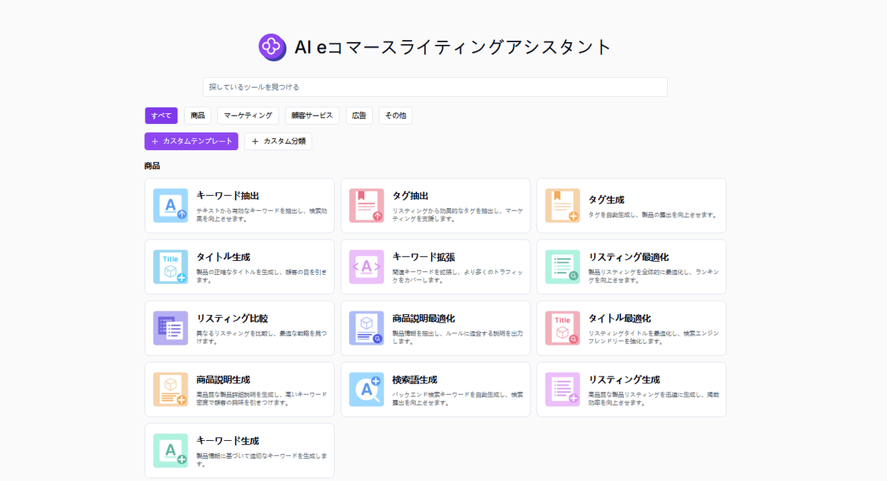

 # 
✏️ AIコマースコピーライティングアシスタント 🚀✨

AI 電子商取引コピーライティングアシスタントは、高品質なクリエイティブなコンテンツを迅速に生成し、既存のコピーライティングを最適化し、さまざまなシーンやターゲットオーディエンスに応じて個性化されたコンテンツをカスタマイズすることができます。

<a href="README_zh.md">中文</a> | <a href="README.md">English</a> | <a href="README_ja.md">日本語</a>

   

[302.AI](https://302.ai)の[AIコマースコピーライティングアシスタント](https://302.ai/ja/tools/ecom/)のオープンソース版です。
302.AIに直接ログインして、コードやコンフィギュレーション不要でオンライン版を使用できます。
または、ご自身のニーズに合わせてこのプロジェクトを修正し、302.AIのAPI KEYを入力して、自身でデプロイすることもできます。

## インターフェースプレビュー
複数の電子商取引のシーンタイプと文案作成方法がオンラインに上がり、選択可能になっています。カスタム文案作成機能も提供しており、あなたが迅速に高品質な文案を生成するのを助けます。
      

商品紹介の生成を例にとると、キーワードを入力するだけで詳細な商品紹介を生成することができ、ユーザーの転換率を向上させます。

## プロジェクトの特徴
### 🛠️ 複数のシーンとプラットフォームに対応
現在、5 つの電子商取引シーンタイプがローンチされており、Amazon（アマゾン）、Walmart（ウォルマート）、Lazada（ラザダ）、Etsy（エツィー）、Mercado Libre（メルカド・リブレ）、Shopee（ショピー）、eBay（イーベイ）、AliExpress（アリエクスプレス）、対外貿易の独立したサイトなどの主要な電子商取引プラットフォームをサポートしています。カスタムコピーライティング作成機能が提供されて、さまざまなニーズに対応しています。
- 商品
- マーケティング
- カスタマーサービス
- 広告
- その他
### 💻 複数のコピーライティングの書き方
キーワード生成、リスト作成、検索語生成、商品説明生成、タイトル最適化、商品説明最適化、リスト比較、リスト最適化、キーワード拡張、タイトル生成、タグ生成、タグ抽出、キーワード抽出、顧客コメント分析、問い合わせメール生成、デザイン変更分析と提案、キーワード推薦、リスト分析、ユーザープロファイル分析、メール返信生成、アフターセールスメール返信生成、コメント返信生成、ネガティブコメント返信生成、バイヤーメッセージ返信生成、広告タイトル生成、コメント生成、投稿生成、流行語推薦、プロモーション提案、キャリア推薦書生成、マーケティングメール生成、ケーススタディ生成、対外貿易開発書簡生成、商品紹介生成。
### 🌍 多言語生成
中国語、英語、日本語などを含むがこれらに限定されない多くの言語でのコピーライティング生成をサポートしており、ユーザーが世界市場のコンテンツ作成ニーズに対応するのを簡単に支援しています。
### 🌐 完全な国際化
- 中国語インターフェース
- 英語インターフェース
- 日本語インターフェース

AIコマースコピーライティングアシスタントを使用することで、高品質なクリエイティブコンテンツを迅速に生成し、既存のコピーを最適化し、異なるシナリオやターゲットオーディエンスに基づいてコンテンツをカスタマイズできます。🎉💻 AIが導くコードの新世界を一緒に探索しましょう！🌟🚀

## 🚩 将来のアップデート計画
- [ ] 競合商品分析を取り入れ、競合商品のコピーライティング及び商品特性の分析能力を強化する
- [ ] クリエイティブな形式を拡張する

## 技術スタック
- Next.js 14
- Tailwind CSS
- Shadcn UI

## 開発とデプロイ
1. プロジェクトをクローン `git clone https://github.com/302ai/302_e_commerce_copywriting_assistant`
2. 依存関係をインストール `npm install`
3. 302のAPI KEYを設定（.env.exampleを参照）
4. プロジェクトを実行 `npm dev`
5. ビルドとデプロイ `docker build -t coder-generator . && docker run -p 3000:3000 coder-generator`

## ✨ 302.AIについて ✨
[302.AI](https://302.ai)は、ユーザーのAI実践における最後の1マイルの課題を解決する従量課金制のAIアプリケーションプラットフォームです。
1. 🧠 言語モデル、画像モデル、音声モデル、動画モデルを含む、最新かつ包括的なAI機能とブランドを集約
2. 🚀 基本モデルの上で深層的なアプリケーション開発を行い、単なるチャットボットではなく、真のAI製品を開発
3. 💰 月額料金なし、全機能が従量課金制、完全オープンで、真の意味で参入障壁が低く、上限が高い
4. 🛠 チームや中小企業向けの強力な管理バックエンド - 1人で管理、複数人で使用可能
5. 🔗 すべてのAI機能がAPI接続を提供し、全ツールがオープンソースでカスタマイズ可能（進行中）
6. 💡 強力な開発チーム、週2-3個の新規アプリケーションをリリース、製品は毎日更新。参加に興味のある開発者も歓迎
