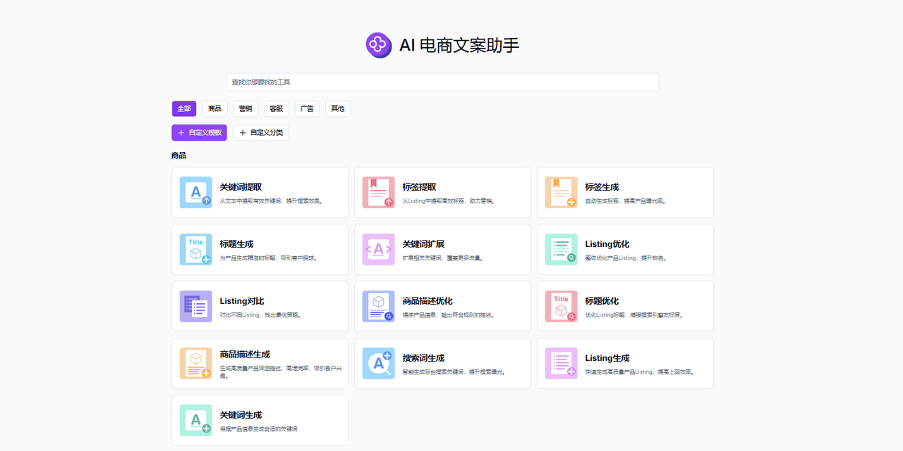
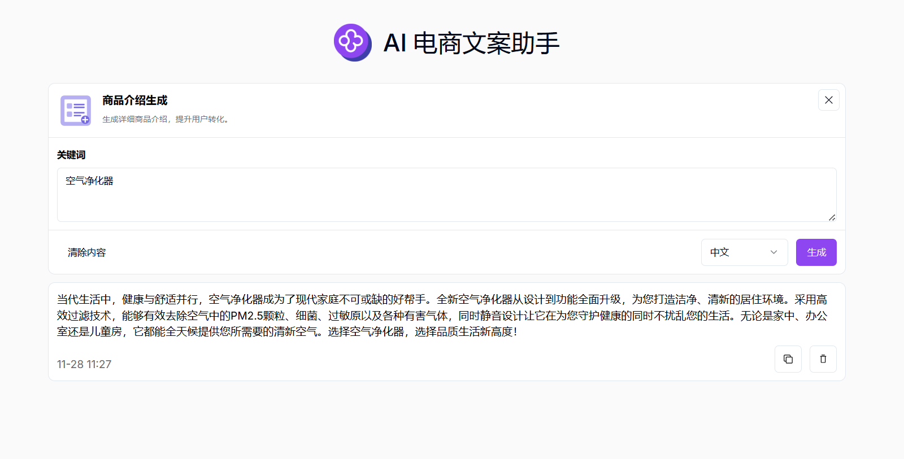

# 
✏️ AI 电商文案助手 🚀✨

AI电商文案助手可以快速生成高质量的创意内容、优化现有文案、并根据不同场景和目标受众定制个性化内容。

<a href="README zh.md">中文</a> | <a href="README.md">English</a> | <a href="README_ja.md">日本語</a>

来自[302.AI](https://302.ai)的[AI 电商文案助手](https://302.ai/tools/ecom/)的开源版本。
你可以直接登录302.AI，零代码零配置使用在线版本。
或者对本项目根据自己的需求进行修改，传入302.AI的API KEY，自行部署。

## 界面预览
已上线五种电商场景类型，多种文案编写方式可供选择，提供自定义文案制作功能，帮助您快速生成高质量的文案。
       

以商品介绍生成为例，输入关键词，即可生成详细商品介绍，提升用户转化。

## 项目特性
### 🛠️ 支持多场景多平台
目前已上线五种电商场景类型，支持各大电商平台：亚马逊、沃尔玛、Lazada、Etsy、美客多、Shopee、ebay、速卖通、外贸独立站等，提供自定义文案制作功能，满足不同需求。
  - 商品
  - 营销
  - 客服
  - 广告
  - 其他
  
### 💻 多种文案编写方式
关键词生成、Listing生成、搜索词生成、商品描述生成、标题优化、商品描述优化、Listing对比、Listing优化、关键词扩展、标题生成、标签生成、标签提取、关键词提取、客户评论分析、询价邮件生成、改款分析建议、关键词推荐、Listing分析、用户画像分析、邮件回复生成、售后邮件回复生成、评论回复生成、差评回复生成、买家消息回复生成、广告标题生成、评论生成、Post生成、流行词推荐、推广建议、带货邀约信生成、营销邮件生成、Case Study生成、外贸开发信生成、商品介绍生成。

### 🌍 多语言生成 
支持多种语言的文案生成，包括但不限于中文、英文、日文等，帮助用户轻松应对全球市场的内容创作需求。

### 🌐 全面国际化 
  - 中文界面
  - English Interface
  - 日本語インターフェース

通过AI 电商文案助手,可以快速生成高质量的创意内容、优化现有文案、并根据不同场景和目标受众定制个性化内容。 🎉💻 让我们一起探索AI驱动的代码新世界吧! 🌟🚀

## 🚩 未来更新计划
- [ ] 竞品分析融入，增强对竞品文案及产品特点的分析能力
- [ ] 创意形式拓展
  
## 技术栈
- Next.js 14
- Tailwind CSS
- Shadcn UI

## 开发&部署
1. 克隆项目 `git clone https://github.com/302ai/302_e_commerce_copywriting_assistant`
2. 安装依赖 `npm install`
3. 配置302的API KEY 参考.env.example
4. 运行项目 `npm dev`
5. 打包部署 `docker build -t coder-generator . && docker run -p 3000:3000 coder-generator`

## ✨ 302.AI介绍 ✨
[302.AI](https://302.ai)是一个按需付费的AI应用平台，为用户解决AI用于实践的最后一公里问题。
1. 🧠 集合了最新最全的AI能力和品牌，包括但不限于语言模型、图像模型、声音模型、视频模型。
2. 🚀 在基础模型上进行深度应用开发，我们开发真正的AI产品，而不是简单的对话机器人
3. 💰 零月费，所有功能按需付费，全面开放，做到真正的门槛低，上限高。
4. 🛠 功能强大的管理后台，面向团队和中小企业，一人管理，多人使用。
5. 🔗 所有AI能力均提供API接入，所有工具开源可自行定制（进行中）。
6. 💡 强大的开发团队，每周推出2-3个新应用，产品每日更新。有兴趣加入的开发者也欢迎联系我们
